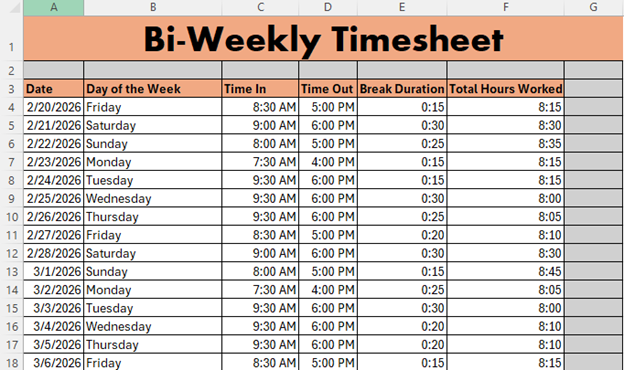
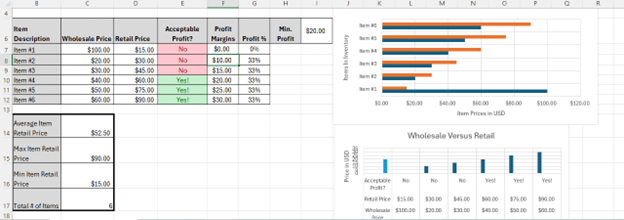
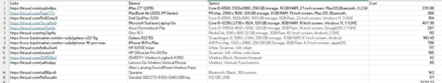

# CS105/6/7/8 Portfolio
# Finnegan Meier
## Portfolio
Contact Info: Phone,Instagram
### About Me 
Hello! I am an experienced Traveler and Vacation professional with over four years of proven expertise in travel and tourism. 
 
With skills in travelling, exploring , meeting new people, and seeing new places, I am able to competently tour, and achieve great vacations. I am adept at using PowerPoint, Word, and Excel. 
 
My Impressive skill set, commitment to hard work, and passion for the world make me a valuable asset.  In my spare time, I like to play video games and party

### Education 
Loyola University Maryland, Manasquan High School, specialized History-Political Science
### Projects

#### Timesheet
 
 
[Project Link](https://studentsloyola-my.sharepoint.com/:x:/g/personal/fjmeier_loyola_edu/IQDTPo3nu2mDT5_adLrPCsXpASp0lFxVLvvTeBQGmO_kujo?e=kGk0rg&wdLOR=c1DAC5A3F-4073-4AFA-BF63-3D8E9643C9B1)

Summary:Schedules are important in the world of business,
 so I set out to properly configure a timesheet for a business and its employees.
 A tool I used was Excel,
 and navigating that along with using date-based formulas and proper formatting was a challenge.
 Result: An organized, readable timesheet that effectively schedules and tracks employee worktime.

***
#### Profit Tracker
 

[Project Link](https://studentsloyola-my.sharepoint.com/:x:/g/personal/fjmeier_loyola_edu/IQD53SaY78KYRrV50WY7BNgVASdA6YGz5G5IPMVS7qR98g0?e=mhdFAx&wdLOR=c60D2B64C-51BF-494F-9485-851A8BB5D1D8)

Summary:Revenue and Profit are the cornerstones of a successful enterprise, 
and knowing exactly how much money you are raking in is vital for economic success. 
That is why I whipped up this profit tracker in Excel.  Utilizing mathematic formulas, 
creating legible charts with valuable data were some of the challenges I faced.
Result:A useful template for an Excel-based profit tracker.

***
#### Consumer Electronic Spreadsheet
 
 
[Project Link](https://studentsloyola-my.sharepoint.com/:x:/g/personal/fjmeier_loyola_edu/IQByMZyue1_WRptGOK9XLGRwAWBLGpfOLA9BHNWqHfw6K1Y?e=AhyxyD&wdLOR=cC6A3BC4C-A2D7-444D-BB54-FC3E3CB48804)

Summary:Collecting valuable information on various types of consumer electronics, and
the internet, online stores, Excel were some of the resources I used. Some of the challenges I faced were
comparing equipment and calculating which model of a given type of electronic is most valuable for me.
Other resources utilized include Google and Wikipedia.
Result: I reinforced my knowledge of consumer electronics and gained insights into the various types of products on offer.

